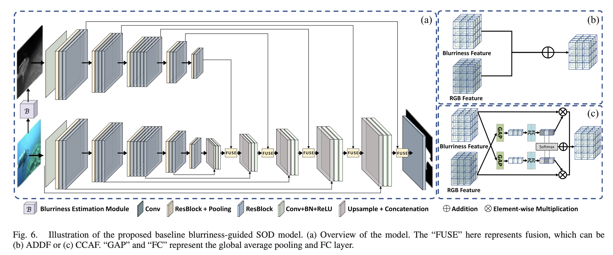

# Blurriness-Guided Underwater Salient Object Detection and Data Augmentation, IEEE Journal of Oceanic Engineering, 2024
Salient object detection (SOD) has made significant progress with the help of deep networks. However, most works focus on terrestrial scenes, but underwater scenes for SOD are still little explored, which is essential for artificial-intelligence-driven underwater scene analysis. In the article, we propose and discuss two practical approaches to boost the performance of underwater SOD based on an inherent property of underwater scenes—blurriness, since an object appears more blurred when it is farther away. First, we utilize a self-derived blurriness cue and fuse it with the input image to help boost SOD accuracy. Next, we propose a blurriness-assisted data augmentation method that works for any available SOD model, called FocusAugment, for underwater SOD. We adjust images to enlarge differences between more- and less-focused regions based on the blurriness maps to augment training data. The experimental results show that both approaches can significantly improve state-of-the-art SOD models' accuracy for underwater scenes.

## Introduction
This research proposes two practical approaches to improve underwater salient object detection (SOD) performance, both based on an inherent property of underwater scenes—blurriness—as objects appear more blurred when they are farther away.

## Network Architecture of ADDF and CCAF



## U-SOD

The underwater salient object detection (U-SOD) dataset contains 1,111 underwater images with various contents, backgrounds, and watercolors. 
The dataset can be downloaded here: https://tinyurl.com/yk5fum9s.


## Structure
<pre>
underwater/
├── model/                      
│   ├── unet_parts.py          
│   ├── unet_model_ResNet50_def_decoder_add.py  # ADDF implementation
│   ├── unet_model_ResNet50_def_decoder_caf.py  # CCAF decoder implementation
├── pytorch_iou/
│   ├── __init__.py
├──pytorch_ssim/
│   ├── __init__.py
├── Unet_train.py             
├── Unet_test.py  
├── data_loader_UNet.py
└── dataset/                                    # Dataset handling code and data
</pre>


## Installation
### 1. Create Environment

```bash
conda create --name myenv python=3.8
conda activate myenv
```

### 2. Install Dependencies

```bash
conda-lock lock -f conda-lock.yml --platform linux-64
pip install -r pip_packages.txt
```

### 3. Training

Train the model with the following command:

```bash
python Unet_train.py uw -save_dir ./training_stats -val_freq 50 -d true -b resnet50
```

Parameters:
- `uw`: Dataset name
- `-save_dir ./training_stats`: Directory to save training statistics
- `-val_freq 50`: Validation frequency (every 50 iterations)
- `-d true`: Enable defocus mode
- `-b resnet50`: Use ResNet50 as backbone

### 4. Testing

Test the trained model with:

```bash
python Unet_test.py uw --save true --defocus true --backbone resnet50 --pretrain [model]
```
Parameters:
- `uw`: Dataset name
- `--save true`: Save test results
- `--defocus true`: Enable defocus mode
- `--backbone resnet50`: Use ResNet50 as backbone
- `--pretrain [model]`: Path to pretrained model weights


# Cite our work:
```
@article{peng2024blurriness,<br />
  title={Blurriness-Guided Underwater Salient Object Detection and Data Augmentation},<br />
  author={Peng, Yan-Tsung and Lin, Yu-Cheng and Peng, Wen-Yi and Liu, Chen-Yu},<br />
  journal={IEEE Journal of Oceanic Engineering},<br />
  year={2024},<br />
  publisher={IEEE}<br />
}
```

